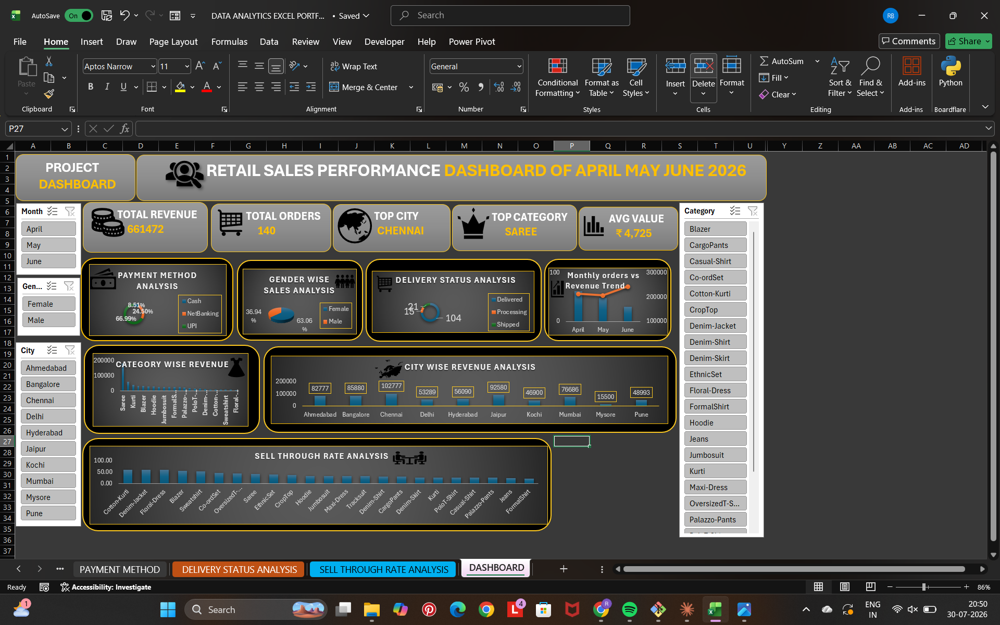

# Excel Portfolio — Retail Sales Performance Dashboard
An Excel dashboard analyzing 3 months (April–June 2026) of retail sales data for a retail apparel business
built entirely with pivot tables, slicers, and charts. Covers revenue trends, city and category performance, payment methods, delivery status, and sell-through rate.

📂 File: [DATA ANALYTICS EXCEL PORTFOLIO.xlsx](DATA%20ANALYTICS%20EXCEL%20PORTFOLIO.xlsx)

# Objective
Identify which product categories and cities drive the most revenue, understand customer buying patterns, and evaluate inventory sell-through helping the business prioritize stock and marketing spend where it matters most.

# Dataset
140 orders across 10 cities and 23 product categories, covering order details, customer demographics, category, city, delivery status, payment method, price, quantity, revenue, and customer rating.

 **Due to company data privacy policy, only a limited 3-month window with a fixed set of price tiers was shared for this analysis, rather than the full product catalog and pricing history.**

## Raw Dataset

This is the raw sales dataset used for the analysis.

# TOOLS AND TECHNOLOGIES 
# Microsoft Excel 
Pivot Tables, Slicers, Power Query, Charts (donut, bar, combo)

 # Dashboard Sections
 
 **Sheet	                   -  What it covers
 Monthly Orders & Revenue	  - Orders and revenue trend across April–June
 Revenue by City	           - City-wise revenue breakdown
 Gender Wise Sales	         - Revenue split by customer gender
 Category Wise Revenue	     - Revenue ranked by product category
 Payment Method Analysis	   - Revenue share by payment method (Cash / UPI / Net Banking)
 Delivery Status Analysis	  - Order breakdown by delivery stage
Sell-Through Rate Analysis 	- Units sold vs. stock received, by category
Dashboard	                  - All of the above combined into one interactive view**

# Sample Views
 
## 📊 Main Dashboard
The dashboard provides an interactive overview of retail sales performance across revenue, product categories, cities, payment methods, delivery status, 
and sell-through rate.

## 📈 Key Insights

- Identified the highest-performing product categories.
- Compared revenue across multiple cities.
- Analyzed customer payment preferences.
- Evaluated delivery status performance.
- Measured sell-through rate to assess inventory movement.

**Fathima Suzain · Data Analytics Portfolio · 2026**
